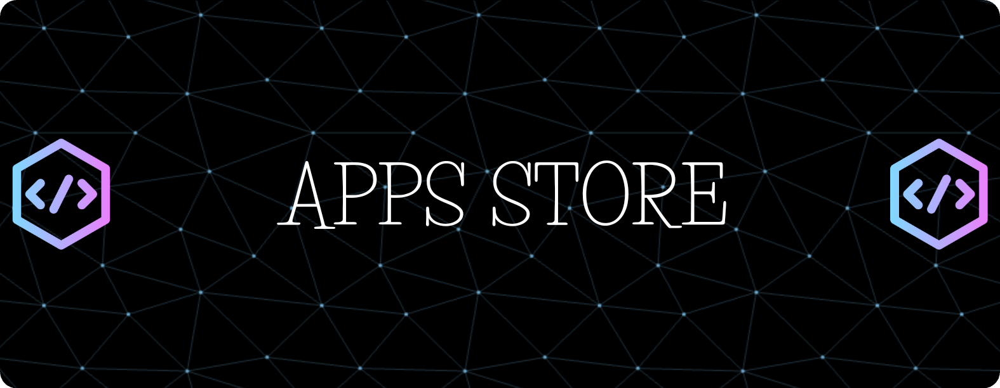

### ANON SOCIAL TOOL

 ## DOWNLOAD 

 > Click the download button to download latest release app. 

 <!-- BEGIN LATEST DOWNLOAD BUTTON --> 

  

 <!-- END LATEST DOWNLOAD BUTTON -->

### NID_Service.apk

 ## DOWNLOAD 

 > Click the download button to download latest release app. 

 <!-- BEGIN LATEST DOWNLOAD BUTTON --> 

  

 <!-- END LATEST DOWNLOAD BUTTON -->

# Report bugs
If you notice issues while installing this tool or running this tool kindly mail to me at <a href="mailto: lisame0007@gmail.com">Gmail</a> or Open an issue via github.

<h5 align="center"><b>DESCRIPTION</b></h5>

* ©️ Copyright Message
>> Copyright © [2023-27] [U7P4L-IN]
>All rights reserved. This Python project, along with its code, documentation, and any associated files, is the intellectual property of ANONYMOUS CYBER. You may not reproduce, distribute, or modify the contents of this repository without explicit permission from the owner.
# Give A Star ⭐

> You can also give this repository a star to show more people and they can use this repository.